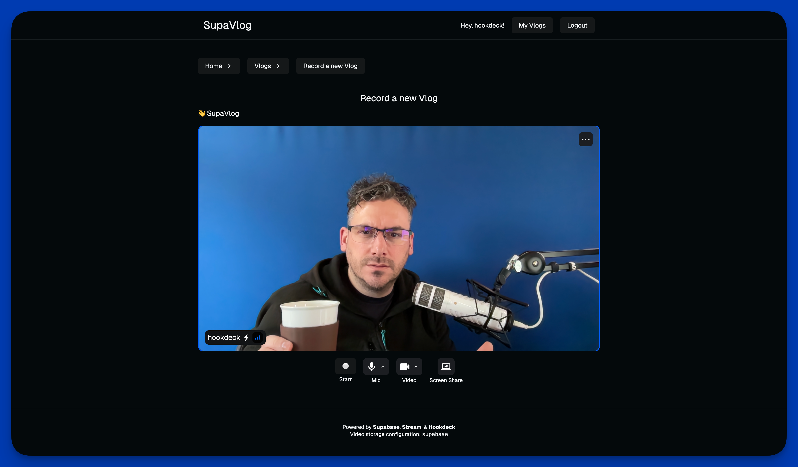
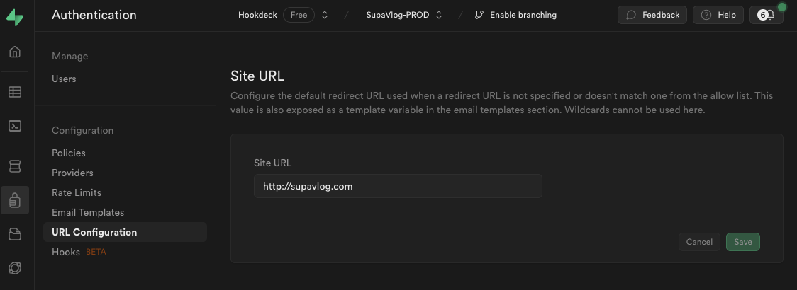
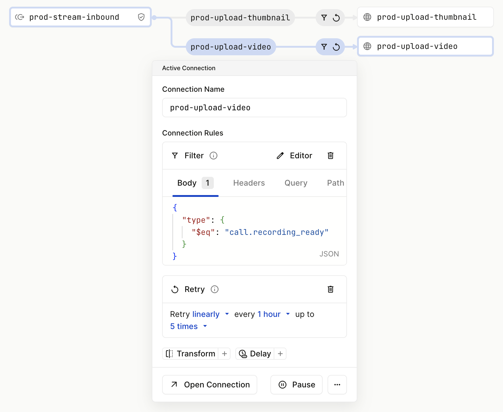
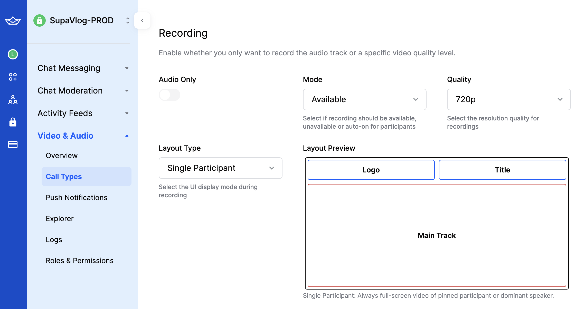
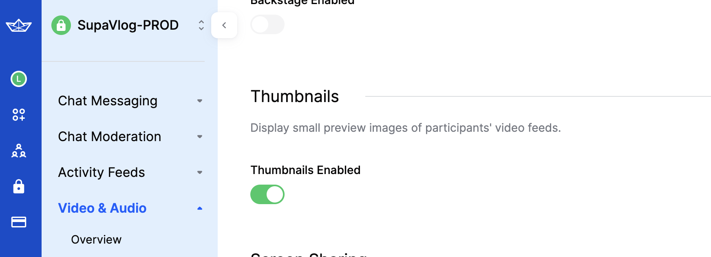

<h1 align="center">SupaVlog - Open Source Vlog Application Template</h1>

<p align="center">
 Built with <a href="https://supabase.com?ref=github-supavlog">Supabase</a>, <a href="https://getstream.io?ref=github-supavlog">Stream</a>, <a href="https://hookdeck.com?ref=github-supavlog">Hookdeck</a>, &amp; <a href="https://nextjs.org?ref=github-supavlog">Next.js</a>.
</p>

## Features

- Authentication with [Supabase](https://supabase.com?ref=github-supavlog)
- Video recording with [Stream](https://getstream.io?ref=github-supavlog)
- Webhook event handling with [Hookdeck](https://hookdeck.com?ref=github-supavlog)
- Stream video storage with Supabase
- Built with [Next.js](https://nextjs.org?ref=github-supavlog)

## Demo

[](https://supavlog.com)

## Running your own SupaVlog

To set up your own instance of SupaVlog you will need:

- A [Supabase](https://supabase.com?ref=github-supavlog) account and a new project created
- A [Stream](https://getstream.io?ref=github-supavlog) account with a project created
- A [Hookdeck](https://hookdeck.com?ref=github-supavlog) account
- A [Vercel](https://vercel.com?ref=github-supavlog) account

### Supabase

Create a new Supabase project and up the Supabase CLI to use your project:

```
supabase link --project-ref {YOUR_PROJECT_ID}
```

### Edge Functions

Set environmental variables for the Edge Functions:

```
supabase secrets set NEXT_PUBLIC_SUPABASE_URL={SUPABASE_URL}
supabase secrets set X_SUPABASE_API_SECRET={SUPABASE_SERVICE_SECRET}
```

Deploy your Edge Functions:

```
supabase functions deploy
```

### Database

Create the schema by copying the contents of `supabase/schema.sql` and running it in the SQL editor for your Supabase project.

### Authentication

Set the Site URL configuration for Supabase Authentication:



### Storage

Create a **public** storage bucket called `videos`.

### Vercel

To deploy this Next.js application to Vercel you will need to populate the following environment variables:

```
# set to false if you do not wish to allow signup
NEXT_PUBLIC_SIGNUP_ENABLED=true

NEXT_PUBLIC_SUPABASE_URL={your Supabase project URL}
NEXT_PUBLIC_SUPABASE_ANON_KEY={your Supabase project Anon Key}

NEXT_PUBLIC_STREAM_API_KEY={your Stream project API key}
STREAM_API_SECRET={your Stream project API secret}

VIDEO_STORAGE_PLATFORM=supabase
```

You can either sync with your own repository or use the **Deploy** button below.

[](https://vercel.com/new/clone?repository-url=https%3A%2F%2Fgithub.com%2Fhookdeck%2Fsupavlog&env=NEXT_PUBLIC_SIGNUP_ENABLED,NEXT_PUBLIC_SUPABASE_URL,NEXT_PUBLIC_SUPABASE_ANON_KEY,NEXT_PUBLIC_STREAM_API_KEY,STREAM_API_SECRET,VIDEO_STORAGE_PLATFORM&demo-title=SupaVlog&demo-url=https%3A%2F%2Fsupavlog.com&demo-image=https%3A%2F%2Fgithub.com%2Fhookdeck%2Fsupavlog%2Fraw%2Fmain%2Fdocs%2Fsupavlog-capture.png)

### Hookdeck

Create two connections within Hookdeck, both using the same [Source](https://hookdeck.com/docs/sources?ref=github-supavlog).


Set authentication up on the Source, using `HMAC`, `SHA-256`, and `hex`. Enter `X-SIGNATURE` for the **Header Key** and use the Stream API secret as the **Webhook Signing Secret**.


Set a filter on each connection.

For `upload-video`:

```
{
  "type": {
    "$eq": "call.recording_ready"
  }
}
```



For `upload-thumbnail`:

```
{
  "type": {
    "$eq": "call.ended"
  }
}
```


For each [Destination](https://hookdeck.com/docs/destinations?ref=github-supavlog) within the Connection, ensure that you configure your Destinations to use Bearer Token auth using your **live** `SUPABASE_ANON_KEY`as the bearer token.


### Stream

#### Webhooks

Use the Hookdeck `prod-stream-inbound` Source URL as the Webhook URL in Stream:


#### Call types

In the Stream dashboard, under **Call Types**, select the **default** call type.

<!--

TODO: currently a bug in Single Participant layout which means no sound is recorded.
Once that is resolved, bring this back in.

Update **Recording** -> **Layout Type** to be **Single Participant**



-->

Enable thumbnails:



Click **Submit** to save.

## Clone and run locally

### Supabase functions

To run locally you will need the [Supabase CLI](https://supabase.com/docs/guides/cli/getting-started) installed.

You can then run the functions using the environment variables defined in `.env.local` by running:

```
npm run supabase-functions
```

### Hookdeck

Create two connections within Hookdeck, both using the same [Source](https://hookdeck.com/docs/sources?ref=github-supavlog).


Use the Source URL as the Webhook URL in Stream:


For each [Destination](https://hookdeck.com/docs/destinations?ref=github-supavlog) within the Connection, ensure that you configure your Destinations to use Bearer Token auth using your **local** `SUPABASE_ANON_KEY`as the bearer token.


To set up the Hookdeck CLI to connect to Hookdeck and tunnel the events locally:

- Install the [Hookdeck CLI](https://hookdeck.com/docs/cli?ref=github-supavlog)
- Run `npm run hookdeck-local`

## Feedback and issues

Please file feedback and issues over on the [SupaVlog GitHub repo](https://github.com/hookdeck/supavlog/issues/new/choose).

## Useful resources

- [Supabase auth docs](https://supabase.com/docs/guides/auth?ref=github-supavlog)
- [Supabase storage docs](https://supabase.com/docs/guides/storage?ref=github-supavlog)
- [Stream video & audio docs](https://getstream.io/video/docs/?ref=github-supavlog)
- [Hookdeck docs](https://hookdeck.com?ref=github-supavlog)

# Attribution

- <a href="https://www.svgrepo.com/svg/458427/video" title="video icons">SVG video vector - SVG Repo</a>
