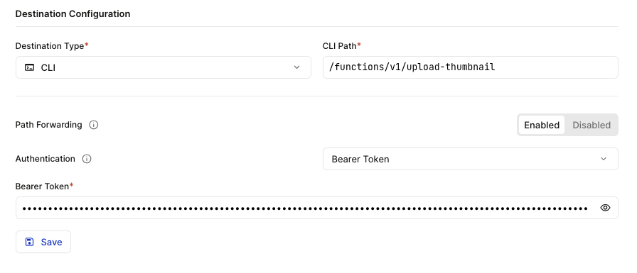

<h1 align="center">SupaVlog - Open Source Micro Blogging Application</h1>

<p align="center">
 Built with <a href="https://supabase.com?ref=github-supavlog">Supabase</a>, <a href="https://getstream.io?ref=github-supavlog">Stream</a>, <a href="https://hookdeck.com?ref=github-supavlog">Hookdeck</a>, &amp; <a href="https://nextjs.org?ref=github-supavlog">Next.js</a>.
</p>

## Features

- Authentication with [Supabase](https://supabase.com?ref=github-supavlog)
- Video recording with [Stream](https://getstream.io?ref=github-supavlog)
- Webhook event handling with [Hookdeck](https://hookdeck.com?ref=github-supavlog)
- Stream video storage with Supabase
- Built with [Next.js](https://nextjs.org?ref=github-supavlog)

## Demo

[](https://supavlog.com)

TODO

## Clone and run locally

### Supabase functions

To run locally you will need the [Supabase CLI](https://supabase.com/docs/guides/cli/getting-started) installed.

You can then run the functions using the values defined in `.env.local` by running:

```
npm run supabase-functions
```

### Hookdeck

Create two connections within Hookdeck, both using the same [Source](https://hookdeck.com/docs/sources?ref=github-supavlog).


Use the Source URL as the Webhook URL in Stream:


For each [Destination](https://hookdeck.com/docs/destinations?ref=github-supavlog) within the Connection, ensure that you configure your Destinations to use Bearer Token auth using your **local** `SUPABASE_ANON_KEY`as the bearer token.



To set up the Hookdeck CLI to connect to Hookdeck and tunnel the events locally:

- Install the [Hookdeck CLI](https://hookdeck.com/docs/cli?ref=github-supavlog)
- Run `npm run hookdeck-local`

## Running in production

### Supabase

Create a new Supabase project and up the Supabase CLI to use your project:

```
supabase link --project-ref {YOUR_PROJECT_ID}
```

Set environmental variables for the Edge Functions:

```
supabase secrets set NEXT_PUBLIC_SUPABASE_URL={SUPABASE_URL}
supabase secrets set X_SUPABASE_API_SECRET={SUPABASE_SERVICE_SECRET}
```

Create the schema by copying the contents of `supabase/schema.sql` and running it in the SQL editor for your Supabase project.

### Vercel

TODO

## Feedback and issues

Please file feedback and issues over on the [SupaVlog GitHub repo](https://github.com/hookdeck/supavlog/issues/new/choose).

## Useful resources

- [Supabase auth docs](https://supabase.com/docs/guides/auth?ref=github-supavlog)
- [Supabase storage docs](https://supabase.com/docs/guides/storage?ref=github-supavlog)
- [Stream video & audio docs](https://getstream.io/video/docs/?ref=github-supavlog)
- [Hookdeck docs](https://hookdeck.com?ref=github-supavlog)

# Attribution

- <a href="https://www.svgrepo.com/svg/458427/video" title="video icons">SVG video vector - SVG Repo</a>
